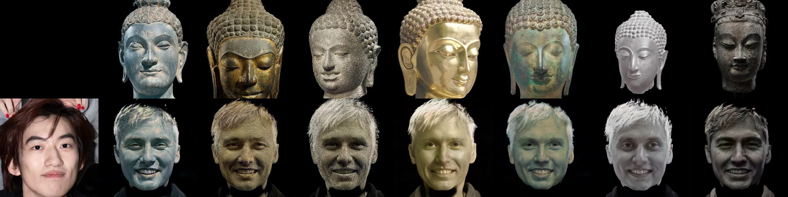

# 图像处理大作业——基于DualStyleGAN的人脸佛像化实现

易小鱼

## 主要工作

1. 收集并预处理[佛像数据集](https://universe.roboflow.com/buddha/detection-buddha)
2. 在佛像数据集上训练并微调DualStyleGAN
3. 基于Gradio搭建网页demo

## 环境与依赖

在文件`buddha.yml`中。

## 训练集、训练日志、checkpoint下载

访问该[北大网盘链接]()可下载处理好的佛像训练集、训练日志和训练好的模型权重。

## 效果

## 参考
本代码完全基于[DualStyleGAN](https://github.com/williamyang1991/DualStyleGAN/tree/main)开发，更详细的使用说明请参见原项目地址。